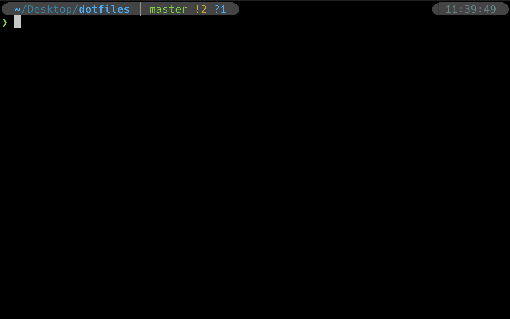
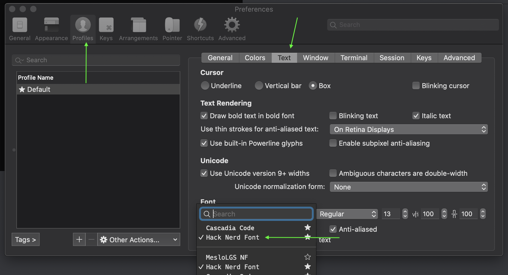
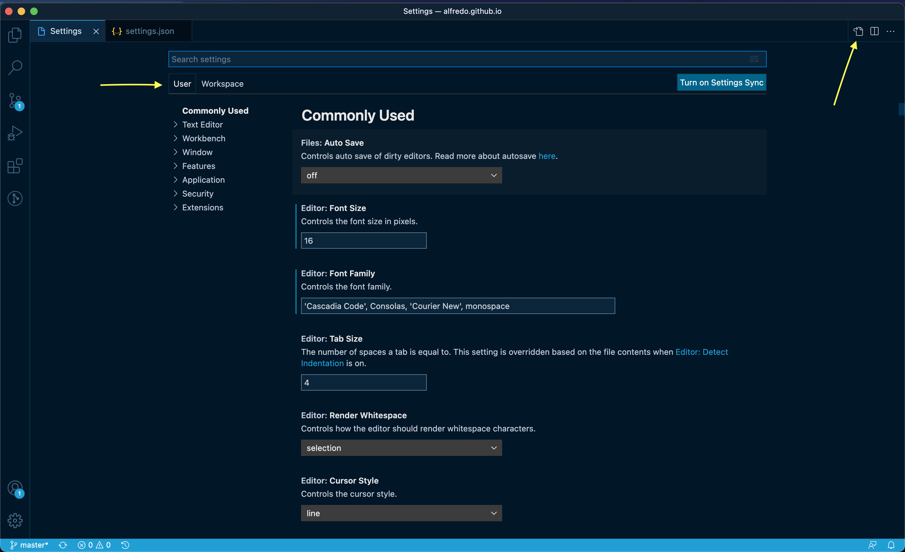
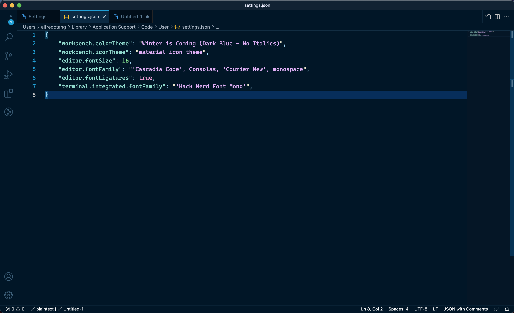
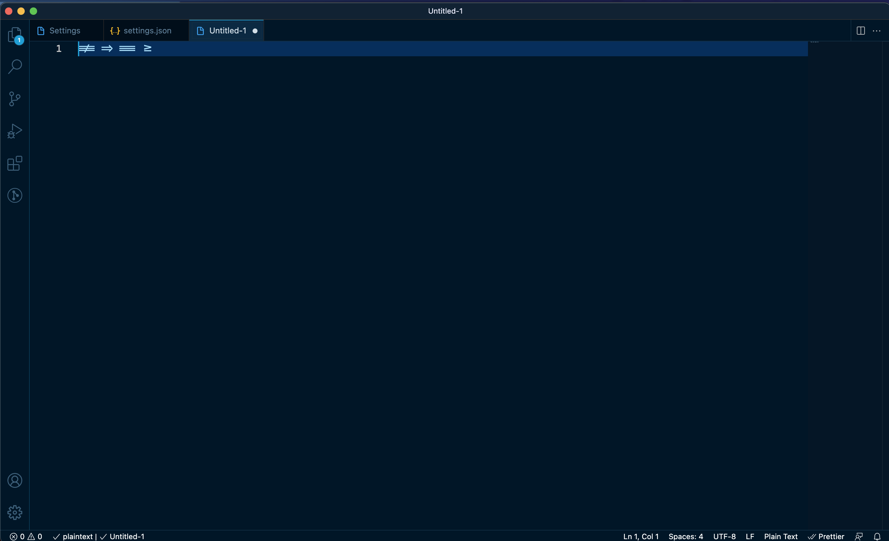

# dotFiles

## macOS
### 1. install homebrew
```
/bin/bash -c "$(curl -fsSL https://raw.githubusercontent.com/Homebrew/install/HEAD/install.sh)"
```
### 2. install configuration `install.sh`
   
   ```
   /bin/bash -c "$(curl -fsSL https://raw.githubusercontent.com/alfredotang/dotfiles/master/macOS/install.sh)"
   ```
### 3. Setting `iTerm` font family


   open iTerm and press

   ```
   ⌘ + ,
   ```
   ```
   profiles -> Text -> font -> choose `Hack Nerd Font`
   ```


### 4. Setting `VSCode` font family

   open **VSCode** and press

   ```
   ⌘ + ,
   ```

   choose `user` & open `settings.json`

   


   copy into `settings.json`
   ```shell
   "editor.fontFamily": "'Cascadia Code', Consolas, 'Courier New', monospace",
   "editor.fontLigatures": true,
   "terminal.integrated.fontFamily": "'Hack Nerd Font Mono'",
   ```
   

   