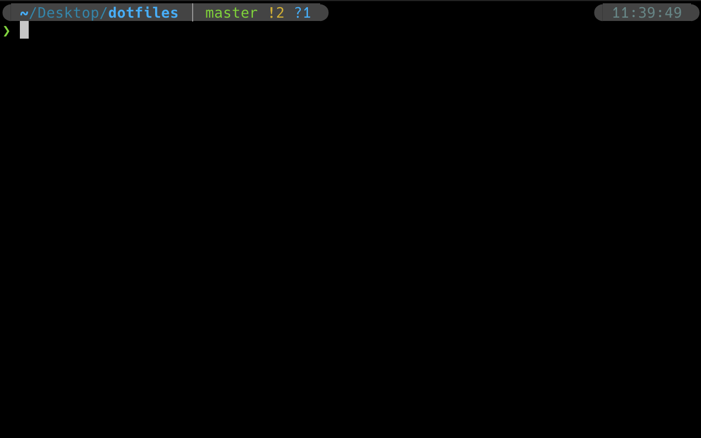

# dotFiles

## macOS
### 1. install homebrew
```
/bin/bash -c "$(curl -fsSL https://raw.githubusercontent.com/Homebrew/install/HEAD/install.sh)"
```
### 2. install configuration `install.sh`
   
   ```
   /bin/bash -c "$(curl -fsSL https://raw.githubusercontent.com/alfredotang/dotfiles/main/macOS/install.sh)"
   ```
### neovim
```
git clone https://github.com/alfredotang/dotfiles.git

```
#### Make a backup of your current nvim config
```
mv ~/.config/nvim ~/.config/nvim_backup
```
#### Clean neovim folders (Optional but recommended)
```
mv ~/.local/share/nvim ~/.local/share/nvim.bak
mv ~/.local/state/nvim ~/.local/state/nvim.bak
mv ~/.cache/nvim ~/.cache/nvim.bak
```

#### Copy the new nvim config
```
cp -r dotfiles/nvim ~/.config/nvim
```

